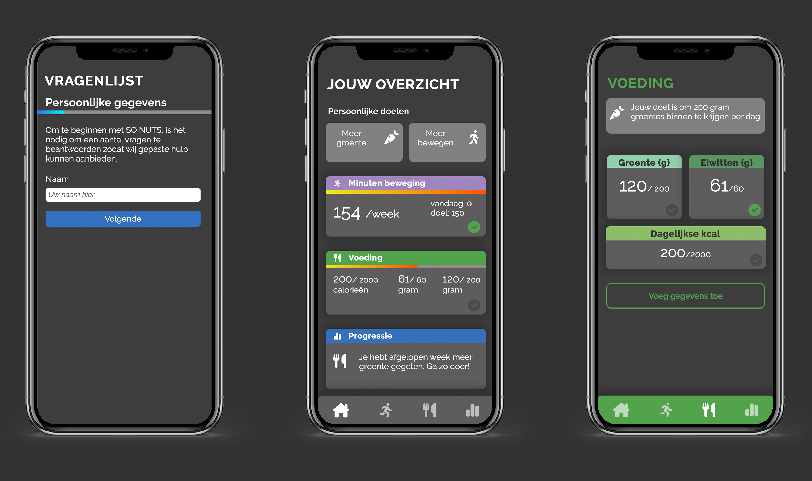

# So Nuts
_Deze opdracht is gemaakt voor SO-NUTS  voor de Meesterproef dat gegeven wordt tijdens de minor Webdesign & Webdevelopment aan de Hogeschool van Amsterdam_


##  🌐 Live Demo
De live demo is [hier](https://cmd-so-nuts.herokuapp.com/) te bekijken.
## Inhoudsopgave
  * [Installatie](#installatie)
  * [Debrief](#debrief)
  * [Opdrachtgever](#opdrachtgever)
  * [Design challenge](#design-challege)
  * [Data](#data)
  * [Licentie](#licentie)

## Installatie
#### This project is made with
* Node.js
* Express
* EJS

#### Clone the repository
```
git clone https://github.com/kiara1404/so-nuts
```

#### Installeer alle packages
```
npm install
```

#### Start de applicatie lokaal
```
nodemon run dev
```


## Wishlist

## Licentie


This work is licensed under [GNU GPLv3](./LICENSE).

